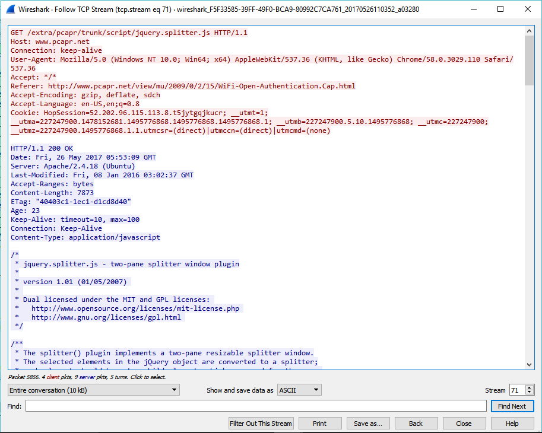

# Some extra Features of Wireshark

## TCP Stream

What is TCP Stream?
> TCP is a connection-oriented protocol meaning it first sets up a connection to the receiver then sends the data in segments   (PDU for transport layer) which is carried by IP packets. This way it's called stream because it keeps the stream of data     between to ends during transfer.

How to do TCP Stream?
> select a TCP packet in the packet list of the stream/connection you are interested in and then select the Follow TCP Stream   menu item from the Wireshark Tools menu. Wireshark will set an appropriate display filter and pop up a dialog box with all     the data from the TCP stream laid out in order.

## Checksum

