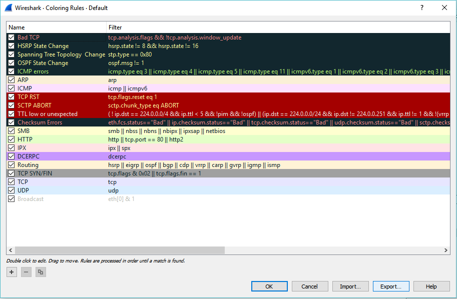
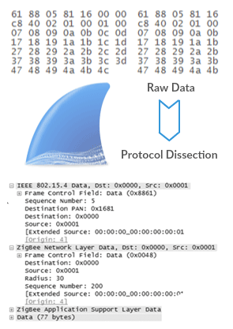
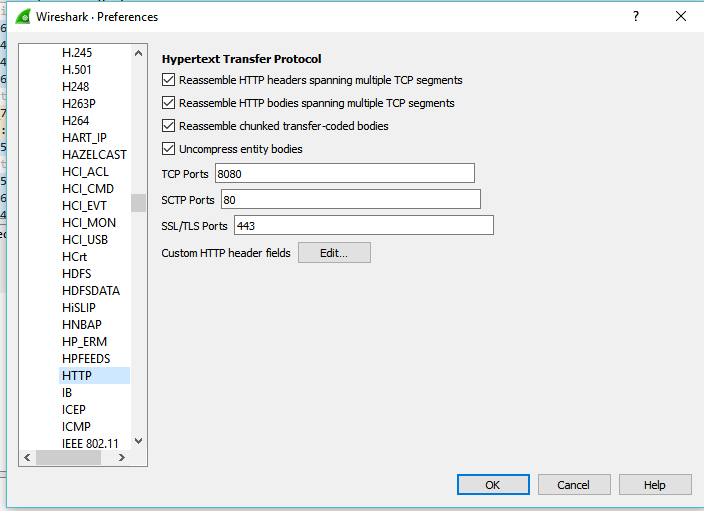
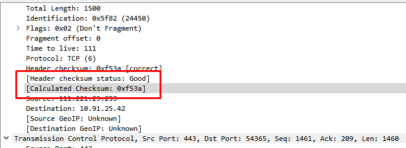
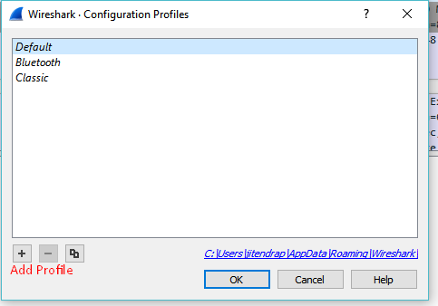

# Some extra Features of Wireshark

## TCP Stream

What is TCP Stream?
> TCP is a connection-oriented protocol meaning it first sets up a connection to the receiver then sends the data in segments   (PDU for transport layer) which is carried by IP packets. This way it's called stream because it keeps the stream of data     between to ends during transfer.

How to do TCP Stream?
> select a TCP packet in the packet list of the stream/connection you are interested in and then select the Follow TCP Stream   menu item from the Wireshark Tools menu. Wireshark will set an appropriate display filter and pop up a dialog box with all     the data from the TCP stream laid out in order.

## Coloring Rules
Both coloring rules and display filters share the same syntax.

## Dissector 

Dissector is simply a protocol parser. 

Each dissector decodes its part of the protocol, and then hands off decoding to subsequent dissectors for an encapsulated protocol.

Every dissection starts with the Frame dissector which dissects the packet details of the capture file itself (e.g. timestamps). From there it passes the data on to the lowest-level data dissector, e.g. the Ethernet dissector for the Ethernet header. The payload is then passed on to the next dissector (e.g. IP) and so on. At each stage, details of the packet will be decoded and displayed.

Some benefits of Dissectors:
**Dealing with some non-standard TCP/UDP ports.**

## Checksum

**What are checksums for?**
>Checksums are used to ensure the integrity of data portions for data transmission or storage. A checksum is basically a calculated summary of such a data portion.

>Network data transmissions often produce errors, such as toggled, missing or duplicated bits. As a result, the data received might not be identical to the data transmitted, which is obviously a bad thing.

The checksum calculation might be done by the **network driver, protocol driver or even in hardware**.
For example: The Ethernet transmitting hardware calculates the Ethernet CRC32 checksum and the receiving hardware validates this checksum. If the received checksum is wrong Wireshark won’t even see the packet, as the Ethernet hardware internally throws away the packet.

Higher level checksums are “traditionally” calculated by the protocol implementation and the completed packet is then handed over to the hardware.
Recent network hardware can perform advanced features such as IP checksum calculation, also known as **checksum offloading**. The network driver won’t calculate the checksum itself but will simply hand over an empty (zero or garbage filled) checksum field to the hardware.

## Profiles

Configuration Profiles can be used to configure and use more than one set of preferences and configurations.

Profiles can be used for customization wireshark settings.
The benefits of profiles are
1. Customize the configuration.
2. Change the display format.
3. Disable or Enable the functions of wireshark.
4. Add new entries to wireshark.

You can easily switch between the profiles and can changed the configuration with a click.

Acces to profile options 
**Edit-> Configuration Profiles**

