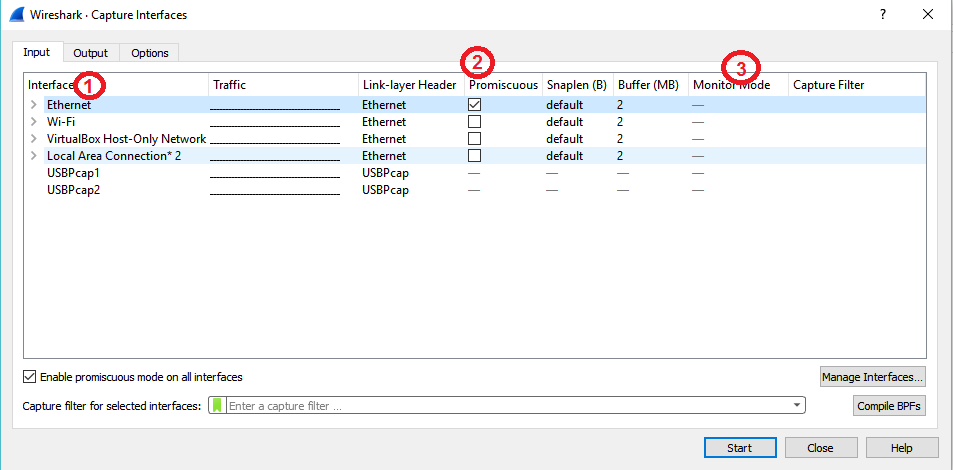
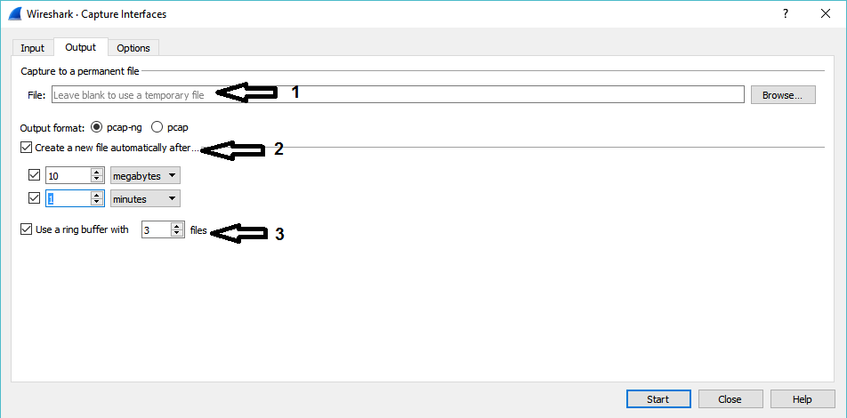
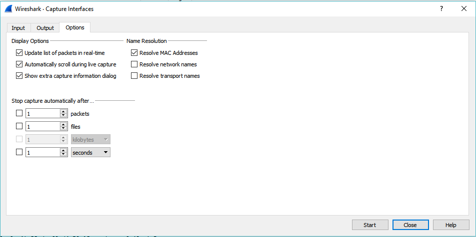

# Capturing Live Packets

Capturing the live packets is one of the main feature of Wireshark

wireshark capture enginr provides following features 
- Support to differenttypes of network hardware such as Ethernet or 802.11.
- Simultaneously show decoded packets while Wireshark is capturing.
- Filtering capability.
- Supports to multiple files while doing long term capturing.
- Simultaneously capture from multiple network interfaces.

### Starting Capture of Packets

- You can start capturing by clicking on any Interface from the available interface list
  **Capture - Options** Select Inerface and click on **Start**.
  
  
  1. **Interface**        This Field will show Local Interface wireshark can access.
  1. **Promiscus Mode**   THis field enabled or disabled PM.
  1. **Monitor Mode**     This Field enabled or disabled MM (Only Available for Unix/Linux).
  
  
  
  1. Capture File Name
  1. Multiple files Specification
     1. Instead a single file wireshark will switch to next file after reaching a specified condition.
     1. You can specify condition as a size or time. wireshark will create new file based on whichever condition satisfied first.
     1. **Ring Buffer** this option will fored a buffer basedd on the given number. in simple terms wireshark will keep only the last 
        specified capture file.
        For Ex- in Ring buffer is 3, then Wireshark will keep only last 3 capture files.
 

