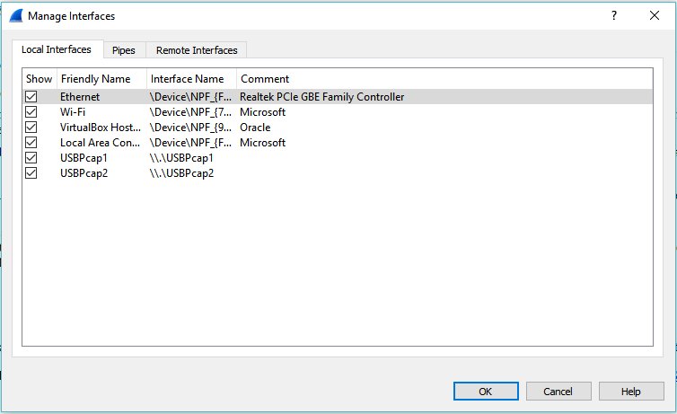
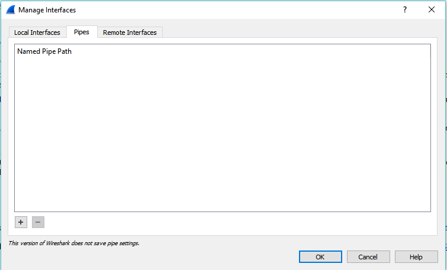
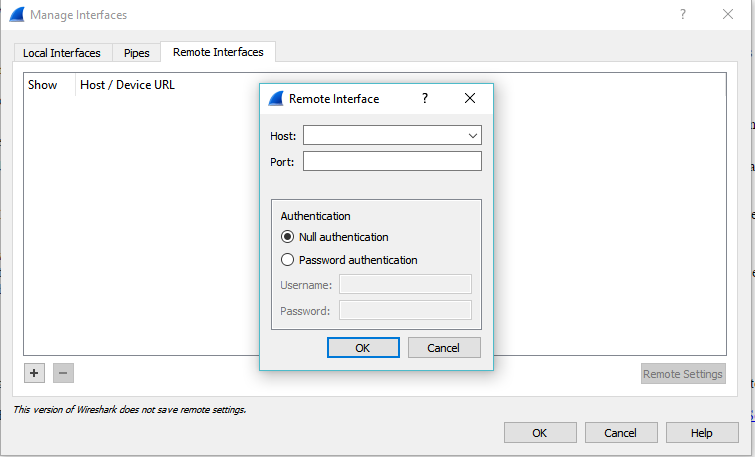

# Capturing Live Packets

Capturing the live packets is one of the main feature of Wireshark

wireshark capture enginr provides following features 
- Support to differenttypes of network hardware such as Ethernet or 802.11.
- Simultaneously show decoded packets while Wireshark is capturing.
- Filtering capability.
- Supports to multiple files while doing long term capturing.
- Simultaneously capture from multiple network interfaces.

### Starting Capture of Packets

- You can start capturing by clicking on any Interface from the available interface list
  **Capture - Options** Select Inerface and click on **Start**.
  
  
  1. **Interface**        This Field will show Local Interface wireshark can access.
  1. **Promiscus Mode**   THis field enabled or disabled PM.
  1. **Monitor Mode**     This Field enabled or disabled MM (Only Available for Unix/Linux).

### Multiple Files in Capture Options
  
  
  1. Capture File Name
  1. Multiple files Specification
     1. Instead a single file wireshark will switch to next file after reaching a specified condition.
     1. You can specify condition as a size or time. wireshark will create new file based on whichever condition satisfied first.
     1. **Ring Buffer** this option will fored a buffer basedd on the given number. in simple terms wireshark will keep only the last 
        specified capture file.
        For Ex- in Ring buffer is 3, then Wireshark will keep only last 3 capture files.
 
 ### Name Resolution and Stop Capturing
  
  
#### Name Resolution Frame
  **1.Enable MAC name resolution**  This option allows you to control whether or not Wireshark translates MAC addresses into names.
 1. ARP name resolution (system service): Wireshark will ask the operating system to convert an                                             Ethernet address to the corresponding IP address (e.g. 00:09:5b:01:02:03 → 192.168.0.1).
 1. Ethernet codes (ethers file): If the ARP name resolution failed, Wireshark tries to convert the                                         Ethernet address to a known device name, which has been assigned by the user using an ethers file                                       (e.g. 00:09:5b:01:02:03 → homerouter).
 1. Ethernet manufacturer codes (manuf file): If neither ARP or ethers returns a result, Wireshark                                           tries to convert the first 3 bytes of an ethernet address to an abbreviated manufacturer name,                                           which has been assigned by the IEEE (e.g. 00:09:5b:01:02:03 → Netgear_01:02:03).

 **2.Stop Capture**                  In this field you can setup stop capture functionality as per your specified condition.

### Manage Interfaces 
  
  
  **1.Local Interfaces**   This list consist of all available local interfaces including the hidden ones.
  
  **2.Pipes**
  
  
  
  **3.Remote Interfaces**  Using wireshark you can capture remote interface traffic also.
                         The Remote Packet Capture Protocol service must first be running on the target platform before Wireshark can                            connect to it. Once installation is completed go to the Services control panel, find the Remote Packet Capture                          Protocol service and start it.
                         
                         
                      
      The dialog based functionality to connect remote system is available only for winndows. For Linux/Unix based system you will need       SSH Tunnel to achieve the same.

