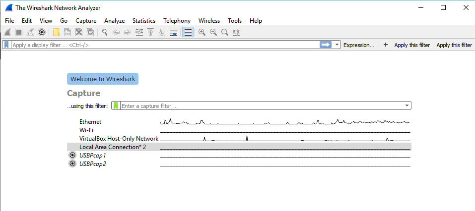

## Navigating to Wiresahrk GUI
GUI of Wireshark Main Window 


### Wireshark GUI in Details


# Some useful Keyboard shortcuts of Wireshark
```
Ctrl + .     Move to the next packet of the conversation.
Ctrl + ,     Move to the Previous packet of the conversation.
Left Arrow   In the packet detail, closes the selected tree item. If it’s already closed, jumps to the parent node.
Right Arrow  In the packet detail, opens the selected tree item.
```
### Wireshark Main Window is divided mainly in 7 Parts
(_For this Excersise please, you can download PCAP file from [here](https://wiki.wireshark.org/SampleCaptures?action=AttachFile&do=get&target=dns.cap)_)

1. Menu Bar
2. Main Toolbar
3. Filter Toolbar
4. Packet List pane
5. Packet Bytes Pane
6. Packet List Pane
7. Status Bar


### 1. Menu Bar
Menu bar mostly used in starting the actions


### 2. Main Toolbar
Main Toolbar contains some of the frequently used items from Menu Bar.
User cannot customized this bar.

    1. Capture Options          - Using this option you can select the Interface from the list and also toggle the option for                                             **Promiscus Mode**.
    2. Start Capture            - Stating the capture of packets.
    3. Stop Capture             - Stoping the capture of packets.
    4. Next or Previous Packet  - To Move to Next or Prevoius packet in Packet tree. 

### 3. Filter Toolbar
The filter toolbar lets you quickly edit and apply display filters. 


### 4. Packet List Pane
It displays all the packets in the current capture file.


- Each line in Packet List Pane represents a one Packet from capture file.
- Packet list pane show will place information from protocol dissector in column.
- Packet List Pane will show only Higher level protocol information. as higher level protocol overwrite the information of lower level     and most probably you will see only higher protocol layer Information. 
- Packet List pane defult values are - 
  **No, Time, Source, Destination , Protocol, Lenght, Info.**
 #### Packet List Symbols
 
