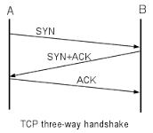

## This section includes some concept required before starting the **wireshark** tutorial.

### What is TCP/IP?
TCP/IP is a set of protocols (Protocol Suit) that enable communication between computers. 
**Protocols** are rules or standards that govern communications. 
If two devices in a network need to communicate, they need to use a common protocol.

### OSI Layer
Open Systems Interconnection is a layered reference model followed by systems when communicating with each other in Network.
It's Seven layer structure where each trailing layer provide data to upper layer for processing.

### Hubs, Switches, Routers

#### Hubs 
Hubs are the common network devices used for LAN (Local Area Network) connectivity. Nowdays Network switches are replacing hubs.
Hubs operates at First layer in OSI.
When a hub receives a packet of data (an **Ethernet frame**) at one of its ports from a network device, **it transmits (repeats) the packet to all of its ports to all of the other network devices**.

#### Switches
Switch forwards the ethernet frame from one system to other system in network based on MAC address.
Switches operates at Layer 2 in OSI Model.

#### 3-Way Handshake 
It's a Method used by TCP/IP to establish the connection between Cliet and Server
1. CLient sends a SYN packet.
2. Server respnds back with SYN+ACK packet.
3. Client Acknowedges the SYN+ACK packet by sending ACK packet to server.

