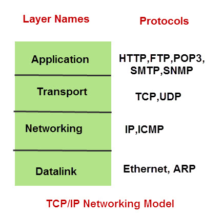

## This section includes some concept required before starting the **wireshark** tutorial.

### What is TCP/IP?
TCP/IP is a set of protocols (Protocol Suit) that enable communication between computers. 
**Protocols** are rules or standards that govern communications. 
If two devices in a network need to communicate, they need to use a common protocol.

