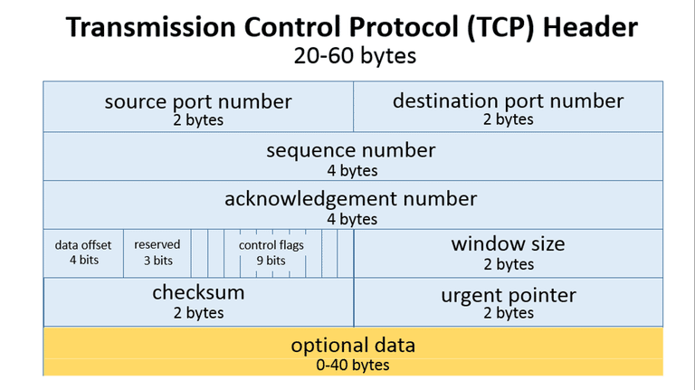

### port 80 and tcp[((tcp[12:1] & 0xf0) >> 2):4] = 0x47455420

Let's Divide the filter 

a = ((tcp[12:1] & 0xf0) >> 2)

tcp[a:4]

First we will have look at **TCP Header**

As you can see **Data Offset will start after 12 Bytes** 
for this we will be using **TCP Slicing** -> tcp(12:1)

tcp(12:1) here **12** will singnify that starting offset in TCP header and 
**1** will signify the count of byte filter should take account from offset.

As per TCP header the data offset size is 4 bit but we are while slicing tcp header 
we take out full 1 byte.

Here comes the reamining part of filter **& 0xf0 >> 2**
0xf0 is in hex form if we convert it in bit we will get 11110000 and 
then we are ANDing it with Sliced TCP Header.
So Now we successfully got first 4 bit values from sliced TCP Header 
but still remaining 4 bit value is there for this we will do **Bit Shifting operation**. 
here comes one more concept when you will do a shifting it will multiply the position 
by 2 so thats why we shifted the value only with 2 and evetually it will get multiply by 2.

Now we got Data offset value - the starting position of Data in TCP,
the remaining part of **:4** will check for first 4 bytes from the sliced tcp part.
the first 4 bytes will get Compare with ASCII equivalent **GET = 0x47455420**

Now you can filter out the GET request.

